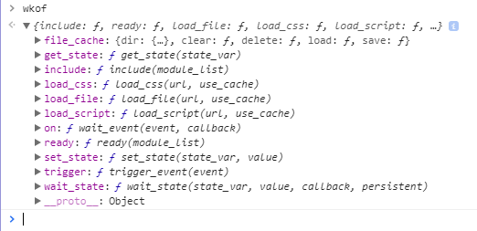
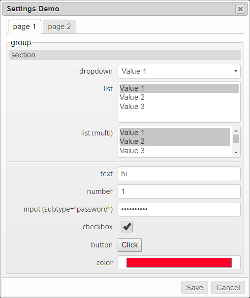
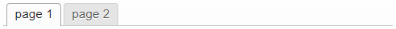
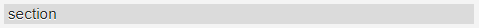
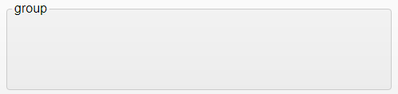

# Wanikani Open Framework

Wanikani Open Framework ("`wkof`") is a user-created framework for rapidly developing web browser userscripts for use with the Japanese kanji learning site [wanikani.com](https://www.wanikani.com).

-----

# Table of Contents

* [Overview](#overview)
* [Installation](#installation)
* [Getting Started](#getting_started)
* [Reference](#reference)
  - [Core](#core_module)
    - [`version`](#wkof_version)
      - [`value`](#version_value)
      - [`compare_to()`](#version_compare_to)
    - [`file_cache`](#file_cache)
      - [`dir {}`](#file_cache_dir)
      - [`save()`](#file_cache_save)
      - [`load()`](#file_cache_load)
      - [`delete()`](#file_cache_delete)
      - [`clear()`](#file_cache_clear)
    - [Loading external files](#loading_files)
      - [`load_file()`](#load_file)
      - [`load_script()`](#load_script)
      - [`load_css()`](#load_css)
  - [ItemData](#item_data_module)
    - [`get_items()`](#itemdata_get_items)
      - [Using a configuration object](#get_items_config)
        - [Options](#get_items_options)
        - [Filters](#get_items_filters)
        - [Inverting Filters](#get_items_invert)
    - [`get_index()`](#itemdata_get_index)
  - [Apiv2](#apiv2_module)
    - [`fetch_endpoint()`](#apiv2_fetch_endpoint)
    - [`get_endpoint()`](#apiv2_get_endpoint)
    - [`clear_cache()`](#apiv2_clear_cache)
    - [`is_valid_apikey_format()`](#apiv2_is_valid_apikey_format)
  - [Menu](#menu_module)
    - [`insert_script_link()`](#menu_insert_script_link)
  - [Progress](#progress_module)
    - [`update()`](#progress_update)
  - [Settings](#settings_module)
    - [`save()`](#settings_save)
    - [`load()`](#settings_load)
    - [`new Settings()`](#settings_constructor)
      - [`config`](#settings_config) _(parameter)_
        - [`tabset`](#settings_config_tabset)
        - [`page`](#settings_config_page)
        - [`section`](#settings_config_section)
        - [`divider`](#settings_config_divider)
        - [`group`](#settings_config_group)
        - [`list`](#settings_config_list)
        - [`dropdown`](#settings_config_dropdown)
        - [`checkbox`](#settings_config_checkbox)
        - [`input`](#settings_config_input)
        - [`number`](#settings_config_number)
        - [`text`](#settings_config_text)
        - [`color`](#settings_config_color)
        - [`button`](#settings_config_button)
        - [`html`](#settings_config_html)
      - [`dialog`](#settings_dialog) _(return)_
      - [Validating Inputs](#settings_validation)
      - [Overriding Paths](#settings_paths)
      - [Examples](#settings_examples)

-----

# <a id="overview">Overview</a>

Wanikani Open Framework ("`wkof`") provides interfaces for:
* Simplifying and coordinating retrieval of site and user data from Wanikani's API.
* Registering additional external data sources, such as additional kanji and vocabulary.
* Adding custom functionality to Wanikani's site menu.
* Creating and automating Settings dialogs for use by userscripts.
* Caching arbitrary files and data for rapid storage and retrieval.

The framework is structured as follows:
* A core script that provides file/url loading and caching services, and an event and state communication interface.
* A set of modules, loaded and cached upon request, providing the bulk of the framework's features.

-----

# <a id="installation">Installation</a>

The core script must be installed in a script-hosting browser plugin, such as TamperMonkey.

1. Install your desired script host plugin.  The script host must be able to specify the run-order of scripts.
2. To use the current release of the Open Framework, click [[here](https://greasyfork.org/en/scripts/38582-wanikani-open-framework)] to install it from greasyfork.org.<br>
If you want to use the latest pre-release version, create a new empty script in TamperMonkey, and paste the contents of the Core.js file from the github repository.
3. Configure your script host plugin to run the Open Framework before all other scripts, which allows client scripts to access the framework at startup.

To verify installation:

1. Navigate to [wanikani.com](https://www.wanikani.com/), log in, and navigate to the Dashboard.
2. Open the Javascript console, type the following command and press enter.

```javascript
wkof
```

3. If the framework is properly installed, the console should list the currently-loaded components of the framework, similar to the result shown below.  If `wkof` is undefined, the framework is not properly installed.

```javascript
{include: f, ready: f, load_file: f, load_css: f, load_script: f, ...}
```

-----

# <a id="getting_started">Getting Started</a>

Before diving into the various interfaces of the framework, take a moment to familiarize yourself with the architecture.

## <a id="wkof_members">`wkof` members</a>

While on the Wanikani Dashboard, run this command in the Javascript console:

```javascript
wkof
```

The `wkof` object should appear at the output of the command (if not, check your installation).
Expand the `wkof` object, and examine its contents:



The `wkof` object is the interface you will use when interacting with the Open Framework and its various modules.

The contents shown above come from the Core script, which we discuss below.
Your console may show additional contents if any framework modules are loaded.

### Checking for Proper Installation

To ensure the best user experience, it is recommended that your script check for the presence of `wkof`, and point the user to installation instructions if it is not installed or is improperly installed.

The code below is the currently recommended method.<br>_(* but see further below if you need a specific version of the framework)_

```javascript
if (!window.wkof) {
    alert('[Your script name here] script requires Wanikani Open Framework.\nYou will now be forwarded to installation instructions.');
    window.location.href = 'https://community.wanikani.com/t/instructions-installing-wanikani-open-framework/28549';
    return;
}
```

### Checking the Framework Version

Some client scripts may require a minimum version of the Open Framework.

**As of version 1.0.14**, the Open Framework includes a version string that is accessible from the `wkof` object:

```javascript
> wkof.version.value
"1.0.14"
```

Also, the `wkof.version.compare_to()` function provides a simple method for checking if the current version is `"older"`, `"same"`, or `"newer"` than a specific version:

```javascript
> wkof.version.value
"1.0.14"
> wkof.version.compare_to('1.0')
"newer"
> wkof.version.compare_to('1.0.14')
"same"
> wkof.version.compare_to('2.1.3')
"older"
```

The code below is the currently recommended method if your code needs a specific version of the framework:

```javascript
var wkof_version_needed = '1.0.14';
if (!window.wkof) {
  alert('[Your script name here] script requires Wanikani Open Framework.\nYou will now be forwarded to installation instructions.');
  window.location.href = 'https://community.wanikani.com/t/instructions-installing-wanikani-open-framework/28549';
  return;
}
if (!wkof.version || wkof.version.compare_to(wkof_version_needed) === 'older') {
  alert('[Your script name here] script requires Wanikani Open Framework version '+wkof_version_needed+'.\nYou will now be forwarded to update page.');
  window.location.href = 'https://greasyfork.org/en/scripts/38582-wanikani-open-framework';
  return;
}
```

**\* _NOTE: This "Getting Started" section is still under development.  Until it is complete, please refer to the [Reference](#reference) section and its numerous examples below.]_**

-----

# <a id="reference">Reference</a>

## <a id="core_module">Core</a>

The core module provides an interface for:
* Loading other modules
* Loading scripts, stylesheets, or any arbitrary file
* Loading and saving files or objects to cache
* Setting and waiting on state variables
* Sending and listening for events

File caching:
* **`version`** - A sub-object for checking the framework version.

File caching:
* **`file_cache`** - A sub-object for caching arbitrary files and data.

Module-loading:
* **`include()`** - A function for loading framework modules.
* **`ready()`** - A function for triggering a callback when a module is ready to use.

Resource-loading:
* **`load_file()`** - A function for loading any file type from a URL.
* **`load_script()`** - A function for loading a Javascript file and installing it into the DOM.
* **`load_css()`** - A function for loading a CSS file and installing it into the DOM.

State functions:
* **`get_state()`** - A function for getting the value of a state variable.
* **`set_state()`** - A function for setting the value of a state variable.
* **`wait_state()`** - A function for specifying a function to call when a state variable reaches a specific state.

Event functions:
* **`on()`** - A function for specifying a function to call when a specific event occurs.
* **`trigger()`** - A function for triggering an event.

In addition to the above core functions, each module (when loaded) will have its own sub-object.  These sub-objects are discussed in the corresponding module documentation.

-----

### <a id="wkof_version">Framework Version</a>

The `version` object allows you check the current version of the Open Framework and compare it against a specific version that your script needs.

The members of the `version` object are:
* **`value`** - A string containing the framework version.
* **`compare_to()`** - A function for comparing the framework version against a specific version number.

-----

### <a id="version_value">`wkof.version.value`</a>

A string containing the framework version.

#### _Example:_
```javascript
var version = wkof.version.value;
console.log('Currently running Open Framework version ' + version);
```

-----

### <a id="version_compare_to">`wkof.version.compare_to(needed_version)`</a>

A function for comparing the framework version against a specific version number.

#### _Parameters:_
* **`needed_version`** - A string containing the version of framework that your script requires.

#### _Return value:_
* **`string`** - A string containing one of the following values:
  - **`"older"`** - The framework is older than your `needed_version`.
  - **`"same"`** - The framework is the same as your `needed_version`.
  - **`"newer"`** - The framework is newer than your `needed_version`.

#### _Example:_
```javascript
var wkof_version_needed = '2.0';
if (!wkof.version || wkof.version.compare_to(wkof_version_needed) === 'older') {
    // TODO: Tell the user they need to upgrade the framework
    console.log('You need to upgrade from version '+wkof.version.value+' to version '+wkof_version_needed + '!');
}

// Output:  You need to upgrade from version 1.0.14 to version 2.0!
```

-----

### <a id="file_cache">File Cache</a>

The `file_cache` object allows you to save and load files or arbitrary objects in indexedDB, the largest-capacity client-side storage interface available to the web page (typically 50MB).

The members of the `file_cache` object are:
* **`dir`** - A sub-object containing a list of all contents stored in the cache.
* **`save()`** - A function for saving a file or object into cache.
* **`load()`** - A function for loading a file or object from cache.
* **`delete()`** - A function for deleting a file, or all files matching a regex pattern, from cache.
* **`clear()`** - A function for clearing all contents from cache.

-----

### <a id="file_cache_dir">`wkof.file_cache.dir`</a>

An object containing a list of files stored in `file_cache`.

#### _Example:_
```javascript
{
    "filename1": {added: "2/6/2018, 3:57:23 PM", last_loaded: "2/6/2018, 3:57:23 PM"}
    "filename2": {added: "2/6/2018, 3:57:21 PM", last_loaded: "2/6/2018, 3:57:21 PM"}
}
```

-----

### <a id="file_cache_save">`wkof.file_cache.save(name, content)`</a>

Saves a file into `file_cache`.

#### _Parameters:_
* **`name`** - Name under which the content will be saved in cache.  Can be any string, including a URL.
* **`content`** - The content to save.  Can be a string or object.

#### _Return value:_
* **`Promise`** - A Promise that resolves when save is complete.

#### _Example:_
```javascript
// Create some data to store in cache.
var timeline_settings = {graph_height: 100, time_format: "24hour"};

// Save the data to cache.
wkof.file_cache.save('timeline_settings', timeline_settings)
.then(function(){
    console.log('Save complete!');
});

// Output:  Save complete!
```

-----

### <a id="file_cache_load">`wkof.file_cache.load(name)`</a>

Loads a file from `file_cache`.

#### _Parameters:_
* **`name`** - Name under which the content will be saved in cache.  Can be any string, including a URL.
* **`content`** - The content to save.  Can be a string or object.

#### _Return value:_
* **`Promise`** - A Promise that resolves with loaded data.

#### _Example:_
```javascript
// Retrieve the data.
wkof.file_cache.load('timeline_settings')
.then(function(settings) {
    // 'settings' contains {graph_height: 100, time_format: "24hour"}
    console.log('Timeline graph height is: ' + settings.graph_height);
});

// Output:  Timeline graph height is: 100
```

-----

### <a id="file_cache_delete">`wkof.file_cache.delete(name | regex)`</a>

Deletes one or more files from `file_cache`, using either the filename or a Regex pattern.

#### _Parameters:_
* **`name`** - Name of file to delete.
* **`regex`** - A Regex pattern matching the files to be deleted.

#### _Return value:_
* **`Promise`** - A Promise that resolves when the file or files are deleted.

#### _Example:_
```javascript
// Delete a file by specifying the full name.
wkof.file_cache.delete('timeline_settings');

// Delete a set of files matching a pattern (e.g. all files starting with "timeline_").
wkof.file_cache.delete(/^timeline_/);
```

-----

### <a id="file_cache_clear">`wkof.file_cache.clear()`</a>

Clears the `file_cache`.

#### _Parameters:_
* none

#### _Return value:_
* **`Promise`** - A Promise that resolves when the cache is clear.

#### _Example:_
```javascript
// Clear the file_cache contents.
wkof.file_cache.clear();
```

-----

## <a id="loading_files">Loading External Files</a>

There are three functions for loading files from an external URL:
* **`load_file()`** - Loads any file type from a URL, .
* **`load_script()`** - Loads a Javascript file, and installing it into the DOM.
* **`load_css()`** - Loads a CSS file, and installing it into the DOM.

-----

### <a id="load_file">`wkof.load_file(url [, use_cache])`</a>

Loads a file from a URL.

#### _Parameters:_
* **`url`** - URL of file to load.
* **`use_cache`** - _(optional)_ If `true`, try loading from cache, and store a copy if fetched (default: false).

#### _Return value:_
* **`Promise`** - A Promise that resolves with the contents at the specified URL.

#### _Example: Retrieve the user's APIv2 key from their account page_
```javascript
// Load the user's account page, and retrieve their APIv2 key.
wkof.load_file('https://www.wanikani.com/settings/account', false /* use_cache */)
.then(function(html_string){
    // Convert the HTML string to DOM using jQuery
    var doc = $(html_string);

    // Extract the API key
    var apiv2_key = doc.find('#user_api_key_v2').val();
    console.log('apiv2_key = '+apiv2_key);
});
```

-----

### <a id="load_script">`wkof.load_script(url [, use_cache])`</a>

Loads a script file from a URL, and installs it into the page.

#### Parameters:
* **`url`** - URL of script file to load.
* **`use_cache`** - _(optional)_ If `true`, try loading from cache, and store a copy if fetched (default: false).

#### Return value:
* **`Promise`** - A Promise that resolves when the script is successfully installed.

#### _Example: Load jQuery UI and theme_
```javascript
// URLs for jQuery UI library and theme
var script = 'https://ajax.googleapis.com/ajax/libs/jqueryui/1.12.1/jquery-ui.min.js';
var css = 'https://ajax.googleapis.com/ajax/libs/jqueryui/1.12.1/themes/smoothness/jquery-ui.css';

// Instead of using `.then()` on each fetch, we will group them with a Promise.all()
var promises = [];
promises[0] = wkof.load_script(script, true /* use_cache */);
promises[1] = wkof.load_css(css, true /* use_cache */);

// Wait until all files are loaded, then do something
Promise.all(promises).then(do_something);

// This function is called when all the files requested above are loaded.
function do_something() {
    // TODO: Do something that makes use of jQuery UI
    console.log('jQuery UI script loaded!');
};
```

-----

### <a id="load_css">`wkof.load_css(url [, use_cache])`</a>

Loads a CSS file from a URL, and installs it into the page.

#### Parameters:
* **`url`** - URL of CSS file to load.
* **`use_cache`** - _(optional)_ If `true`, try loading from cache, and store a copy if fetched (default: false).

#### Return value:
* **`Promise`** - A Promise that resolves when the CSS is successfully installed.

#### _Example: Load jQuery UI and theme_
```javascript
// URLs for jQuery UI library and theme
var script = 'https://ajax.googleapis.com/ajax/libs/jqueryui/1.12.1/jquery-ui.min.js';
var css = 'https://ajax.googleapis.com/ajax/libs/jqueryui/1.12.1/themes/smoothness/jquery-ui.css';

// Instead of using `.then()` on each fetch, we will group them with a Promise.all()
var promises = [];
promises[0] = wkof.load_script(script, true /* use_cache */);
promises[1] = wkof.load_css(css, true /* use_cache */);

// Wait until all files are loaded, then do something
Promise.all(promises).then(do_something);

// This function is called when all the files requested above are loaded.
function do_something() {
    // TODO: Do something that makes use of jQuery UI
    console.log('jQuery UI script loaded!');
};
```

-----

## <a id="item_data_module">ItemData module</a>

The `ItemData` module:
* Provides an interface for fetching and caching item data.
* Cross-links the following Wanikani API endpoint data:
  - `/subjects`
  - `/assignments`
  - `/review_statistics`
  - `/study_materials`
* Provides a set of filters for selecting subsets of item data by various criteria.
* Allows client scripts to register additional data sources (such as an external set of Core10k vocabulary).
* Allows client scripts to register additional filters for selecting items (such as by leech score).
* Provides a global 'Loading...' progress bar when fetching data.

Internally, the module also:
* Coordinates requests from all client scripts to prevent redundant requests to the Wanikani API.
* Reduces browser memory consumption by sharing item objects across all scripts.
* Retrieves only the data requested by the user's active client scripts.

To use the `ItemData` module, you must include it from your script, and wait until the module is ready before accessing it:

```javascript
wkof.include('ItemData');
wkof.ready('ItemData').then(do_something);

function do_something() {
    // TODO:  Add your code to access the ItemData interface.
    console.log('wkof.ItemData is loaded');
}
```

-----

### <a id="itemdata_get_items">`wkof.ItemData.get_items([config])`</a>

Retrieves a set of items from the Wanikani API.  A subset of items can be selected using optional filters.  The results can then be indexed by specific fields using the `get_index()` function.

When considering how to retrieve API data, you should follow these guidelines:
* Use `wkof.ItemData.get_items()` when fetching **one or more endpoints** from `/subjects`, `/assignments`, `/review_statistics`, or `/study_materials` endpoints.  The results are **cached**, and are automatically **cross-linked** against the `/subjects` endpoint.  You can also specify a set of filters if you only want to retrieve a subset of the data, and then optionally index the results using the `wkof.ItemData.get_index()` function.  In general, `wkof.ItemData.get_items()` is the most efficient way of working with item data.

* Use `wkof.Apiv2.get_endpoint()` when fetching a single endpoint, but **only if you want to fetch the entire endpoint and cache the result**.  For example, it's probably not a good idea to use this function to fetch the `/reviews` endpoint since it can contain hundreds of thousands of records.  In such cases, use `wkof.Apiv2.fetch_endpoint()` with an appropriate time range filter instead.

* Use `wkof.Apiv2.fetch_endpoint()` when fetching a subset of data from a single endpoint using one or more of the Wanikani API's built-in filters.

#### Parameters:
* **`config`** - _(optional)_ A string or object that specifies the data sources and filters to be used in fetching the desired items.  (Described in detail <a href="#get_items_config">below</a>).

#### Return value:
* **`Promise`** - A Promise that resolves with the selected items.

#### _Example 1: Fetch items using default configuration (`/subjects` endpoint only)_
```javascript
// Include the ItemData module, and wait for it to be ready.
wkof.include('ItemData');
wkof.ready('ItemData').then(fetch_items);

// This function is called when the ItemData module is ready to use.
function fetch_items() {
    // No 'config' parameter, so we retrieve only the Wanikani /subjects endpoint.
    wkof.ItemData.get_items()
    .then(process_items);
}

function process_items(items) {
    // TODO: Do something with the items we retrieved.
    console.log('Retrieved ' + items.length + ' items.');
}

// Output:  Retrieved 8792 items.
```

#### _Example 2: Fetch items using comma-delimited list of endpoints_
```javascript
// Include the ItemData module, and wait for it to be ready.
wkof.include('ItemData');
wkof.ready('ItemData').then(fetch_items);

// This function is called when the ItemData module is ready to use.
function fetch_items() {
    // Retrieve only the /subjects and /assignments endpoints.
    var config = 'subjects, assignments';

    wkof.ItemData.get_items(config)
    .then(process_items);
}

function process_items(items) {
    // TODO: Do something with the items we retrieved.
    console.log('Retrieved ' + items.length + ' items.');
}

// Output:  Retrieved 8792 items.
```

### <a id="get_items_config">Using a configuration object with `wkof.ItemData.get_items()`</a>

The configuration object can be complex, depending on the desired configuration.  At the top level, it contains a list of data sources that `get_items()` will retrieve from.

```javascript
var config = {
    example_source1: {...},
    example_source2: {...}
};
```

Available sources are found in `wkof.ItemData.registry.sources`.  The only source defined by the Open Framework itself is `wk_items`, which represents the Wanikani API.  Client scripts can define additional data sources by adding a source definition to the registry.

```javascript
var config = {
    wk_items: {...}
};
```

Each source can have an `options` sub-object and a `filters` sub-object.  These are described in detail below.

```javascript
var config = {
    wk_items: {
        options: {...},
        filters: {...}
    }
};
```

#### <a id="get_items_options">Options</a>

The `options` sub-object allows you to set non-default values when configuring a source.  The available options are found in `wkof.ItemData.registry.sources.<source_name>.options`.

For `wk_items`, the following options are available:
* **`assignments`** - If `true`, add info from the `/assignments` endpoint to each item.  (Default is `false`).
* **`review_statistics`** - If `true`, add info from the `/review_statistics` endpoint to each item.  (Default is `false`).
* **`study_materials`** - If `true`, add info from the `/study_materials` endpoint to each item.  (Default is `false`).
* **`include_hidden`** - If `true`, include items that have been hidden (i.e. deleted) by Wanikani.  (Default is `false`).

For example, the following configuration will fetch the `/subjects`, `/assignments`, and `/review_statistics` endpoints. (Note: The `/subjects` endpoint will always be fetched, since all other endpoints reference the subject data).

```javascript
var config = {
    wk_items: {
        options: {
            assignments: true,
            review_statistics: true
        }
    }
};
```

#### <a id="get_items_filters">Filters</a>

The `filters` sub-object allows you to add criteria for narrowing down the list of items returned by `get_items()`.  For example, you can filter by Wanikani level, SRS level, etc.  If no filters are specified in the config, all retrieved items will be returned.

The available filters are found in `wkof.ItemData.registry.sources.<source_name>.filters`.

For `wk_items`, the following filters are currently available:
* **`item_type`** - An array or comma-delimited string specifying the item types to return.  Supported values are `rad`, `kan`, and `voc`.

  Examples:
  - `['rad','kan']` - _(array)_ Return radicals and kanji.
  - `'kan, voc'` - _(string)_ Return kanji and vocabulary.

* **`level`** - A comma-separated list of Wanikani levels or level ranges to return.

  Examples:
  - `'1,2,3'` - Return items from levels 1, 2, and 3.
  - `'1..3,5'` - Return items from levels 1 through 3, and 5.
  - `'-1'` - Return items from your previous level (current level minus 1).
  - `'+1'` - Return items from your next level (current level plus 1).
  - `'-5..+0'` - Return items from your last 5 levels, including your current level.
  - `'1..-1'` - Return items from levels 1 through your last level (current minus 1).
  - `'*, !-3..-1'` - Return items from all levels, but exclude the last three levels.

* **`srs`** - An array or comma-delimited string specifying the SRS levels to return.<br>Supported values are `lock`, `init`, `appr1`, `appr2`, `appr3`, `appr4`, `guru1`, `guru2`, `mast`, `enli`, and `burn`.<br>Also, numeric values `-1` to `9` are accepted, where `-1` = `lock`, `0` = `init`, `1` = `appr1`, etc.

  Examples:
  - `['init']` - Return items in the lesson queue.
  - `['appr1','appr2','appr3','appr4']` - Return all Apprentice items (Apprentice 1 through 4).
  - `'mast, enli, burn'` - Return all Master, Enlightened, and Burned items.
  - `'7, 8, 9'` - Return all Master, Enlightened, and Burned items.

* **`have_burned`** - _(boolean)_ If `true`, return all items that have been previously burned, even if they are currently resurrected.  If `false`, return all items that have never been burned.

#### <a id="get_items_invert">Inverting filters</a>

You can optionally invert the results of any filter by converting the filter value to an object, and adding an `invert` member to the object.  Below is a before-and-after example:

```javascript
// Fetch all current-level vocabulary.  (Filters not inverted)
var config = {
    wk_items: {
        options: {subjects: true, assignments: true},
        filters: {
            level: '+0',
            item_type: 'voc'
        }
    }
};

// Fetch all EXCEPT current-level vocabulary. (Filters inverted)
var config = {
    wk_items: {
        options: {subjects: true, assignments: true},
        filters: {
            level: {value: '+0', invert: true},
            item_type: {value: 'voc', invert: true}
        }
    }
};
```

#### _Example 3: Fetch items using configuration object_
```javascript
// Include the ItemData module, and wait for it to be ready.
wkof.include('ItemData');
wkof.ready('ItemData').then(fetch_items);

// This function is called when the ItemData module is ready to use.
function fetch_items() {
    // Fetch only radicals and kanji from levels 1-3.
    // Include /subjects and /assignments endpoints
    var config = {
        wk_items: {
            options: {subjects: true, assignments: true},
            filters: {
                level: '1..3',
                item_type: 'rad, kan'
            }
        }
    };

    wkof.ItemData.get_items(config)
    .then(process_items);
}

function process_items(items) {
    // TODO: Do something with the items we retrieved.
    console.log('Retrieved ' + items.length + ' items.');
}

// Output:  Retrieved 171 items.
```

-----

### <a id="itemdata_get_index">`wkof.ItemData.get_index(items, index_name)`</a>

Given an array of items returned by `wkof.ItemData.get_items()`, this function creates an index for looking up items in the array based on a specified data field, such as `subject_id`, `item_type`, `slug`, etc.

#### Parameters:
* **`items`** - An array of items returned by `wkof.ItemData.get_items()`.
* **`index_name`** - Name of one of the available index functions.

#### Return value:
* **`object`** - An object whose keys are the field values of the indexed field.

The following index fields are currently available, and can be found in `wkof.ItemData.registry.indices`:

* **`item_type`** - Index by `item.object`
  ```javascript
  {radical: Array(478), kanji: Array(2027), vocabulary: Array(6287)}
  ```
* **`level`** - Index by `item.data.level` (Wanikani level).
   ```javascript
   {1: Array(86), 2: Array(161), 3: Array(127), 4: Array(176), 5: Array(195), …}
   ```
* **`reading`** - Index by `item.data.readings[].reading`
  ```javascript
  {いち: Array(4), ひと: Array(6), かず: Array(4), に: Array(8), ふた: Array(2), …}
  ```
* **`slug`** - Index by `item.data.slug` (e.g. `"大変"`, `"ground"`). **_(\* See note below!)_**
  ```javascript
  {ground: {…}, fins: {…}, drop: {…}, seven: {…}, slide: {…}, …}
  ```
* **`srs_stage`** - Index by `item.assignments.srs_stage` (e.g. `1`=Apprentice1, `9`=Burned).
  ```javascript
  {0: Array(9), 1: Array(26), 3: {…}, 4: Array(12), 5: Array(15), 6: Array(6), …}
  ```
* **`srs_stage_name`** - Index by `item.assignments.srs_stage_name` (e.g. `Apprentice 1` ... `Burned`).
  ```javascript
  {Burned: Array(293), Enlightened: Array(3), Guru II: Array(6), Master: Array(4), Guru I: Array(15), …}
  ```
* **`subject_id`** - Index by `item.subject_id`.
  ```javascript
  {1: {…}, 2: {…}, 3: {…}, 4: {…}, 5: {…}, 6: {…}, 7: {…}, …}
  ```

**_\* Note: Some `slug` entries may be an array!  For example,_ `slug['円']` _contains both a kanji and vocab._**

#### _Example: index by `slug`:_
```javascript
{
    "ground": {id: 1, object: "radical", data: {slug: "ground", ... }, ...},
    "fins": {id: 2, object: "radical", data: {slug: "fins", ... }, ...},
    "drop": {id: 3, object: "radical", data: {slug: "drop", ... }, ...},
    ...
    "円": [
        {id: 472, object: "kanji", data: {slug: "円", ... }, ...},
        {id: 2499, object: "vocabulary", data: {slug: "円", ... }, ...},
    ],
    ...
}
```

#### _Example 1: Fetch items and index by `item_type` and `slug`_
```javascript
// Include the ItemData module, and wait for it to be ready.
wkof.include('ItemData');
wkof.ready('ItemData').then(fetch_items);

// This function is called when the ItemData module is ready to use.
function fetch_items() {
    // No 'config' parameter, so we retrieve only the Wanikani /subjects endpoint.
    wkof.ItemData.get_items()
    .then(process_items);
}

function process_items(items) {
    // Index the 'items' array by item_type.
    var type_index = wkof.ItemData.get_index(items, 'item_type');
    var rad = type_index['radical'];
    var kan = type_index['kanji'];
    var voc = type_index['vocabulary'];
    console.log(
        'Found ' + rad.length + ' radicals, '+
        kan.length + ' kanji, and '+
        voc.length + ' vocabulary.'
    );

    // Index the 'voc' array by slug.
    var voc_by_name = wkof.ItemData.get_index(voc, 'slug');
    console.log('大きい is on WK Level ' + voc_by_name['大きい'].data.level)
}

// Output:  Found 478 radicals, 2027 kanji, and 6287 vocabulary.
// Output:  大きい is on WK Level 1
```

-----

## <a id="apiv2_module">Apiv2 module</a>

The `Apiv2` module:
* Provides an interface for fetching and caching all Wanikani API endpoint data.
* Is a low-level interface to the Wanikani API, and is used by the the higher-level ItemData module.
* Allows you to specify any filters supported by the Wanikani API.
* Is best for fetching the following Wanikani API endpoints (_see `ItemData` module for other endpoints_):
  - `/user`
  - `/summary`
  - `/reviews`
  - `/level_progressions`
  - `/resets`
* Provides a global 'Loading...' progress bar when fetching data.

Internally, the module also:
* Coordinates requests from all client scripts to prevent redundant requests to the Wanikani API.
* Reduces browser memory consumption by sharing item objects across all scripts.
* Retrieves only the data requested by the user's active client scripts.

To use the `Apiv2` module, you must include it from your script, and wait until the module is ready before accessing it:

```javascript
wkof.include('Apiv2');
wkof.ready('Apiv2').then(do_something);

function do_something() {
    // TODO:  Add your code to access the Apiv2 interface.
    console.log('wkof.Apiv2 is loaded');
}
```

-----

### <a id="apiv2_fetch_endpoint">`wkof.Apiv2.fetch_endpoint(endpoint_name [, options])`</a>

Retrieves the contents of a Wanikani API endpoint.

When considering how to retrieve API data, you should follow these guidelines:
* Use `wkof.ItemData.get_items()` when fetching **one or more endpoints** from `/subjects`, `/assignments`, `/review_statistics`, or `/study_materials` endpoints.  The results are **cached**, and are automatically **cross-linked** against the `/subjects` endpoint.  You can also specify a set of filters if you only want to retrieve a subset of the data, and then optionally index the results using the `wkof.ItemData.get_index()` function.  In general, `wkof.ItemData.get_items()` is the most efficient way of working with item data.

* Use `wkof.Apiv2.get_endpoint()` when fetching a single endpoint, but **only if you want to fetch the entire endpoint and cache the result**.  For example, it's probably not a good idea to use this function to fetch the `/reviews` endpoint since it can contain hundreds of thousands of records.  In such cases, use `wkof.Apiv2.fetch_endpoint()` with an appropriate time range filter instead.

* Use `wkof.Apiv2.fetch_endpoint()` when fetching a subset of data from a single endpoint using one or more of the Wanikani API's built-in filters.

#### Parameters:
* **`endpoint_name`** - A string containing the name of the endpoint to be fetched (e.g. "summary").
* **`options`** - _(optional)_ An object that specifies additional optional parameters. _(see `Options` below)_

#### Return value:
* **`Promise`** - A Promise that resolves with the fetched endpoint data.

#### <a id="fetch_endpoint_options">Options</a>
The following optional parameters are supported inside the `options` object:
* **`progress_callback`** - A callback function to be called as the fetch makes incremental progress.
The progress_callback function is called with the following parameters:
  - `endpoint_name` - A string containing the name of the endpoint.
  - `first_new` - The index if the first element received in this progress update.
  - `so_far` - The number of elements retrieved since the fetch began.
  - `total` - The total number of elements that will be retrieved in this fetch.
* **`last_update`** - A Date object, or any string accepted by `new Date(string)`.  Only records modified after this time will be returned.  This value will supercede any `updated_after` filter in the `filters` option.
* **`filters`** - A sub-object containing API filters to be added to the request URL.<br>_(See Wanikani API documentation for supported filters on each endpoint)_<br>

#### _Example 1: Fetch level-ups since the start of 2018:_
```javascript
// Include the Apiv2 module, and wait for it to be ready.
wkof.include('Apiv2');
wkof.ready('Apiv2').then(fetch_data);

// This function is called when the Apiv2 module is ready to use.
function fetch_data() {
    var options = {
        last_update: 'Jan 1, 2018'; // Any date format accepted by "new Date(string)"
    };
    wkof.Apiv2.fetch_endpoint('level_progressions', options)
    .then(process_response);
}

function process_response(response) {
    // Show the results on the Javascript console.
    for (var idx = 0; idx < response.data.length; idx++) {
        var entry = response.data[idx];
        var level = entry.data.level;
        var pass_date = entry.data.passed_at.slice(0, 10);
        console.log('Passed level '+level+' on '+pass_date);
    }
}

// Output:
//   Passed level 4 on 2018-01-17
//   Passed level 5 on 2018-02-03
//   Passed level 6 on 2018-02-20
```

#### _Example 2: Fetch radicals removed from Wanikani since the start of 2014:_
```javascript
// Include the Apiv2 module, and wait for it to be ready.
wkof.include('Apiv2');
wkof.ready('Apiv2').then(fetch_data);

// This function is called when the Apiv2 module is ready to use.
function fetch_data() {
    var options = {
        last_update: '2014-01-01T00:00:00.000000Z',
        filters: {
            types: ['radical'],
            hidden: true
        }
    };
    wkof.Apiv2.fetch_endpoint('subjects', options)
    .then(process_response);
}

function process_response(response) {
    if (response.data.length === 0) {
        // Inject some fake data if no deleted items are currently on record.
        response.data = [{
            "id":59,
            "object":"radical",
            "url":"https://www.wanikani.com/api/v2/subjects/59",
            "data_updated_at":"2018-03-14T00:31:56.396289Z",
            "data":{
                "level":3,
                "created_at":"2012-03-01T01:52:13.000000Z",
                "slug":"raptor-cage",
                "hidden_at":"2018-03-14T00:31:56.396289Z",
                "document_url":"https://www.wanikani.com/radicals/raptor-cage",
                "characters":"久",
                "character_images":[],
                "meanings":[{"meaning":"Raptor Cage","primary":true}]
            }
        }];
    }

    // Show the results on the Javascript console.
    for (var idx = 0; idx < response.data.length; idx++) {
        var entry = response.data[idx];
        var slug = entry.data.slug;
        var hide_date = entry.data.hidden_at.slice(0, 10);
        console.log('Radical "'+slug+'" was removed on '+hide_date);
    }
}

// Output (using injected fake data):
//   Radical "raptor-cage" was removed on 2018-03-14
```

-----

### <a id="apiv2_get_endpoint">`wkof.Apiv2.get_endpoint(endpoint_name [, options])`</a>

Retrieves the contents of a Wanikani API endpoint.

When considering how to retrieve API data, you should follow these guidelines:
* Use `wkof.ItemData.get_items()` when fetching **one or more endpoints** from `/subjects`, `/assignments`, `/review_statistics`, or `/study_materials` endpoints.  The results are **cached**, and are automatically **cross-linked** against the `/subjects` endpoint.  You can also specify a set of filters if you only want to retrieve a subset of the data, and then optionally index the results using the `wkof.ItemData.get_index()` function.  In general, `wkof.ItemData.get_items()` is the most efficient way of working with item data.

* Use `wkof.Apiv2.get_endpoint()` when fetching a single endpoint, but **only if you want to fetch the entire endpoint and cache the result**.  For example, it's probably not a good idea to use this function to fetch the `/reviews` endpoint since it can contain hundreds of thousands of records.  In such cases, use `wkof.Apiv2.fetch_endpoint()` with an appropriate time range filter instead.

* Use `wkof.Apiv2.fetch_endpoint()` when fetching a subset of data from a single endpoint using one or more of the Wanikani API's built-in filters.

#### Parameters:
* **`endpoint_name`** - A string containing the name of the endpoint to be fetched (e.g. "summary").
* **`options`** - _(optional)_ An object that specifies additional optional parameters. _(see `Options` below)_

#### Return value:
* **`Promise`** - A Promise that resolves with the fetched endpoint data.

#### <a id="get_endpoint_options">Options</a>
The following optional parameters are supported inside the `options` object:
* **`progress_callback`** - A callback function to be called as the fetch makes incremental progress.
The progress_callback function is called with the following parameters:
  - `endpoint_name` - A string containing the name of the endpoint.
  - `first_new` - The index if the first element received in this progress update.
  - `so_far` - The number of elements retrieved since the fetch began.
  - `total` - The total number of elements that will be retrieved in this fetch.
* **`force_update`** - By default, `get_endpoint()` will not seek an update from the server if the last update was less than 1 minute ago.  If this flag is `true`, an update is requested every time.

#### _Example: Get the number of lessons and review currently available:_
```javascript
// Include the Apiv2 module, and wait for it to be ready.
wkof.include('Apiv2');
wkof.ready('Apiv2').then(get_data);

// This function is called when the Apiv2 module is ready to use.
function get_data() {
    var options = {
        force_update: true
    };
    wkof.Apiv2.get_endpoint('summary', options)
    .then(process_response);
}

function process_response(response) {
    // Show the results on the Javascript console.
    var lessons = response.lessons;
    var num_items = lessons[0].subject_ids.length;
    console.log(num_items+' lessons available');

    var reviews = response.reviews;
    var num_items = reviews[0].subject_ids.length;
    console.log(num_items+' reviews available');
}

// Output:
//   9 lessons available
//   67 reviews available
```

-----

### <a id="apiv2_clear_cache">`wkof.Apiv2.clear_cache([include_non_user])`</a>

Clears all cached user-specific API data, i.e. everything except the `subjects` endpoint.

#### Parameters:
* **`include_non_user`** - _(optional)_ If `true`, also clear all non-user-specific data.

#### Return value:
* **`Promise`** - A Promise that resolves when the cache is cleared.

#### _Example: Clear all user-specific API data:_
```javascript
// Include the Apiv2 module, and wait for it to be ready.
wkof.include('Apiv2');
wkof.ready('Apiv2').then(clear_cache);

// This function is called when the Apiv2 module is ready to use.
function clear_cache() {
    wkof.Apiv2.clear_cache();
}
```

-----

### <a id="apiv2_is_valid_apikey_format">`wkof.Apiv2.apiv2_is_valid_apikey_format(apikey)`</a>

Checks whether the specified string is a valid APIv2 string format.

#### Parameters:
* **`apikey`** - A string containing an APIv2 key that is to be checked for proper format.

#### Return value:
* **`boolean`** - `true` if the apikey is a valid APIv2 format, otherwise `false`.

#### _Example: Clear all user-specific API data:_
```javascript
// Include the Apiv2 module, and wait for it to be ready.
wkof.include('Apiv2');
wkof.ready('Apiv2').then(check_key);

// This function is called when the Apiv2 module is ready to use.
function check_key() {
    var apikey = '12345678-1234-1234-1234-123456789abc';
    var is_valid = wkof.Apiv2.is_valid_apikey_format(apikey);
    var valid_string = (is_valid ? 'is' : 'is not');
    console.log('Apikey "'+apikey+'" '+valid_string+' correctly formatted.');
}

// Output: Apikey "12345678-1234-1234-1234-123456789abc" is correctly formatted.
```

-----

## <a id="menu_module">Menu module</a>

The `Menu` module provides an interface for adding custom links to the Wanikani menu.

To use the `Menu` module, you must include it from your script, and wait until the module is ready before accessing it:

```javascript
wkof.include('Menu');
wkof.ready('Menu').then(do_something);

function do_something() {
    // TODO:  Add your code to access the Menu interface.
    console.log('wkof.Menu is loaded');
}
```

-----

### <a id="menu_insert_script_link">`wkof.Menu.insert_script_link(config)`</a>

Retrieves a set of items, applies filters to select a subset of those items, and returns an array of the resulting items.  These items can then be indexed by specific fields using the `get_index()` function.

#### Parameters:
* **`config`** - An object describing the link to be installed.  _(see `Config` below)_

#### <a id="insert_script_link_config">Config</a>

The `config` object contains the following:
* **`name`** - A unique identifier string for the link to be inserted.<br>
The inserted `<li>` element will have `id="<name>_script_link"` and `name="<name>"`.
* **`submenu`** - _(optional)_ A string containing the name of a submenu to (create and) insert the link under.
* **`title`** - A string containing the text of the link.
* **`class`** - _(optional)_ A string containing any class names to be added to the `<li>` element.
* **`on_click`** - A callback function to be called when the link is clicked.

#### _Example: Call a function when a menu link is clicked._
```javascript
// Include the Menu module, and wait for it to be ready.
wkof.include('Menu');
wkof.ready('Menu').then(install_menu);

// This function is called when the Menu module is ready to use.
function install_menu() {
    var config = {
        name: 'my_script_open',
        submenu: 'Open',
        title: 'My Script',
        on_click: open_my_script
    };
    wkof.Menu.insert_script_link(config);
}

function open_my_script(items) {
    // TODO: Do something useful.
    console.log('Opening "My Script"...');
}

// Output: Opening "My Script"...
```

-----

## <a id="progress_module">Progress module</a>

The `Progress` module provides an pop-up dialog for displaying progress bars.

To use the `Progress` module, you must include it from your script, and wait until the module is ready before accessing it:

```javascript
wkof.include('Progress');
wkof.ready('Progress').then(do_something);

function do_something() {
    // TODO:  Add your code to access the Progress interface.
    console.log('wkof.Progress is loaded');
}
```

-----

### <a id="progress_update">`wkof.Progress.update(progress)`</a>

Initializes or updates the progress on a task.
The progress dialog will appear if the task is not completed within 1 second.
The dialog will close when all active tasks are complete.
Completion occurs when a task's current `value` is equal to or greater than its `max` value.
If more than one task is active at the same time, the dialog will show a separate progress bar for each task.

#### Parameters:
* **`progress`** - An object describing the current progress status.  _(see below)_.

#### <a id="progress_update_progress">Progress</a>

The `progress` object contains the following:
* **`name`** - A unique identifier string for the progress bar.
* **`label`** - A string containing the text to appear next to the progress bar.
* **`value`** - The number of units currently completed.
* **`max`** - The number of units representing 100% completion.

#### _Example: Simulate 'Core10k' data loading over a 5 second period._
```javascript
wkof.include('Progress');
wkof.ready('Progress').then(do_something);

var progress = {
    name: 'my_script_core10k',
    label: 'Core10k Vocabulary',
    value: 0,
    max: 10000
};

function do_something() {
    // Initialize the progress bar.
    progress.value = 0;
    wkof.Progress.update(progress);

    // Simulate some work
    do_some_work();
}

function do_some_work() {
    // Simulate 250ms worth of work.
    setTimeout(function() {
        // Update the progress bar.
        progress.value += 500;
        wkof.Progress.update(progress);

        // Check if we have more work
        if (progress.value < progress.max)
            do_some_work();
    }, 250);
}
```

-----

## <a id="settings_module">Settings module</a>

The `Settings` module provides a simple way to create a Settings dialog for your script with minimal work.

The module has the following members:
* **`wkof.Settings()`** - A constructor function for creating a dialog object.
* **`wkof.Settings.save()`** - A function for saving a script's stored settings.
* **`wkof.Settings.load()`** - A function for loading a script's stored settings.

Settings are stored in a per-script object under `wkof.settings` (note the lowercase 's').
For example, a 'timeline' script's settings would be located in `wkof.settings.timeline`.

To use the `Settings` module, you must include it from your script, and wait until the module is ready before accessing it:

```javascript
wkof.include('Settings');
wkof.ready('Settings').then(do_something);

function do_something() {
    // TODO:  Add your code to access the Settings interface.
    console.log('wkof.Settings is loaded');
}
```

-----

### <a id="settings_save">`wkof.Settings.save(script_id)`</a>

Save the settings object located at `wkof.settings[script_id]` into storage.

Settings are stored in `wkof.file_cache` under a file named `wkof.settings.[script_id]`.  For example, if your `script_id` is `"my_script"`, the filename in `wkof.file_cache` will be `"wkof.settings.my_script"`.

#### Parameters:
* **`script_id`** - A string that identifies the script whose settings are to be saved.

#### Return value:
* **`Promise`** - A Promise that resolves when the save is complete.

#### _Example: Load settings for a sample script:_
```javascript
// Include the Settings module, and wait for it to be ready.
wkof.include('Settings');
wkof.ready('Settings').then(do_something);

// This function is called when the Settings module is ready to use.
function do_something() {
    // Normally, you wouldn't save settings immediately upload load.  But for the
    // save of having a working example, we will create some settings and save them.

    wkof.settings.my_script = {};
    wkof.settings.my_script.setting1 = 123;
    wkof.settings.my_script.setting2 = 789;
    wkof.Settings.save('my_script');

    // The settings will be stored in 'wkof.file_cache'
    // under a file named 'wkof.settings.my_script'
}
```

-----

### <a id="settings_load">`wkof.Settings.load(script_id [, defaults])`</a>

Loads the specified script's settings from storage.
The loaded settings are returned in the resolved promise, and also at `wkof.settings[script_id]`.

The optional `defaults` object contains defaults that will be assigned to any corresponding settings that are missing in the stored settings.

Settings are loaded from `wkof.file_cache` under a file named `wkof.settings.[script_id]`.  For example, if your `script_id` is `"my_script"`, the filename in `wkof.file_cache` will be `"wkof.settings.my_script"`.
If no file is found, an empty object `{}` is returned.

#### Parameters:
* **`script_id`** - A string that identifies the script whose settings are to be loaded.
* **`defaults`** - _(optional)_An object containing any default values that will be merged in the absence of their corresponding stored settings.

#### Return value:
* **`Promise`** - A Promise that resolves with the loaded settings.

#### _Example: Load settings for a sample script:_
```javascript
// Suppose the following settings are currently in storage:
// {setting1: 123, setting2: 789}

// Include the Settings module, and wait for it to be ready.
wkof.include('Settings');
wkof.ready('Settings').then(load_settings);

// This function is called when the Settings module is ready to use.
function load_settings() {
    var defaults = {
      setting1: 50,
      setting2: 50,
      setting3: 50
    };
    wkof.Settings.load('my_script', defaults)
    .then(process_settings);
}

function process_settings(settings) {
    // For illustration, we will ignore the 'settings' object passed into this function,
    // and will access the settings directly from wkof.settings['my_script'] instead.
    console.log('setting1 = ' + wkof.settings.my_script.setting1);
    console.log('setting2 = ' + wkof.settings.my_script.setting2);
    console.log('setting3 = ' + wkof.settings.my_script.setting3);
}

// Output:
//   setting1 = 123
//   setting2 = 789
//   setting3 = 50    <-- note default value
```

-----

### <a id="settings_constructor">`new wkof.Settings(config)`</a>

A constructor function for building a Settings dialog based on the specified `config` object.

#### Parameters:
* **`config`** - A configuration object describing the contents and behavior of the desired Settings dialog.

#### Return value:
* **`dialog`** - A dialog object, which has a set of member functions you can call _(see below)_.

-----

### <a id="settings_config">The `config` parameter</a>

The following are the top-level contents of the `config` object.  A more detailed description of each member follows.

```javascript
var config = {
    // Required members
    script_id:  // A string ID for the script.  Settings are stored in wkof.settings[script_id].
    title:      // A string that will appear in the Settings dialog's title.

    // Optional flags
    autosave:   // (optional) A boolean indicating whether changes are committed to storage (default: true)
    background: // (optional) A boolean indicating whether a semi-transparent background is displayed (default: true)

    // Optional callbacks
    pre_open:   // (optional) A callback function, called when the dialog opens.
    on_save:    // (optional) A callback function, called when the user clicks the Save button.
    on_cancel:  // (optional) A callback function, called when the user clicks the Cancel button.
    on_close:   // (optional) A callback function, called when the dialog closes.
    on_change:  // (optional) A callback function, called when any setting changes.
    on_refresh: // (optional) A callback function, called just after the dialog has been refreshed.

    // Dialog content
    content: {
        // The content of the dialog box (i.e. layout and settings)
        // [...]
    }
};
```

* **`script_id`** - A string ID for the script.  This is used as the name of the sub-object in `wkof.settings` where settings will be saved.  For example, if `script_id` is `"my_script"`, settings will be stored in `wkof.settings.my_script`.
* **`title`** - A string title for the dialog box.
* **`autosave`** - _(optional)_ If set to `false`, clicking the Save button does not save the settings to storage, though it does change the settings under `wkof.settings[script_id]`.  The default is `true`.
* **`background`** - _(optional)_ If set to `false`, the semi-transparent background overlay will not be used.  The default is `true`.
* **`pre_open()`** - _(optional)_ This callback is called just _after_ the dialog opens, but before `open()` returns.  The intent is to allow you to make final adjustment to the dialog, such as attaching custom event handlers or adding other custom features.

  _Parameters_: `preopen_callback(dialog)`
    - _`dialog`_ - The DOM element of the dialog box.
* **`on_save()`** - _(optional)_ This callback is called just after the user clicks the Save button and the settings are saved to storage, and before the dialog box is closed.  The intent is to allow you to act upon any modified settings, including reading final states of dialog elements if necessary (though usually the framework captures changes automatically).

  _Parameters_: `save_callback(settings)`
    - _`settings`_ - The settings object (i.e. `wkof.settings[script_id]`)
* **`on_cancel()`** - _(optional)_ This callback is called just after the user clicks the Cancel button and the settings are reverted, and before the dialog box is closed.  The intent is to allow you to act upon any reverted settings that may have been acted upon the `on_change` event of any individual settings.

  _Parameters_: `close_callback(settings)`
    - _`settings`_ - The settings object (i.e. `wkof.settings[script_id]`)
* **`on_close()`** - _(optional)_ This callback is called just after the `on_save` or `on_cancel` event, or when the user closes the window via the X.  The intent is to have a common event regardless of the method by which the dialog is closed.

  _Parameters_: `close_callback(settings)`
    - _`settings`_ - The settings object (i.e. `wkof.settings[script_id]`)
* **`on_change()`** - _(optional)_ This callback is called after the user modifies a setting in the dialog and the setting has passed validation (if any).  The intent is to allow you to immediately act upon a change while the dialog is still open, including dynamically modifying other settings in the dialog (e.g. enabling/disabling other fields).

  _Parameters_: `change_callback(name, value, config)`
    - _`name`_ - The name of the configuration sub-object for the changed setting.  For example, given a setting `max_height: {type:"number", label:"Maximum Height", default:10}`, the `name` is `"max_height"`.
    - _`value`_ - The new value of the setting.
    - _`config`_ - The configuration sub-object for the changed settings.  For example, `{type:"number", label:"Maximum Height", default:10}`.
* **`on_refresh()`** - _(optional)_ This callback is called whenever a refresh of the dialog's interface has been requested, immediately after all automatically refreshed elements have been refreshed.  The intent is to allow you to refresh any custom elements in your dialog.<br>
  A refresh occurs under the following circumstances:
  - Immediately after the dialog opens, to populate the dialog with initial values from `wkof.settings[script_id]`.
  - Whenever a setting marked with `refresh_on_change:true` is changed.
  - Whenever your script calls `.refresh()` on your dialog object, such as after you have programmatically modified a setting in `wkof.settings[script_id]`.

  _Parameters_: `refresh_callback(settings)`
    - _`settings`_ - The settings object (i.e. `wkof.settings[script_id]`)

* **`content`** - A sub-object containing a collection of components that define the contents of the Settings dialog.  These components are described in detail below.

-----

### <a id="settings_content">Settings `config.content` sub-object</a>

The image below is the dialog box created by _settings\_demo.js_.  It illustrates the various built-in components supported by the Settings module.



-----

#### <a id="settings_config_tabset">Settings `tabset` component</a>

The `tabset` component serves as a wrapper for a group of `page` components.

The `tabset` itself does not have a visual representation, but the `page` components that it contains will each appear as a separate tab in a tabset.

The `tabset` configuration is as follows:

```javascript
tabset_id: {
    type: 'tabset',
    content: {
        // A collection of "page" objects.  For example:
        // page1: {...},
        // page2: {...}
        // ...
    }
}
```

-----

#### <a id="settings_config_page">Settings `page` component</a>

The `page` component represents the contents of a single tab in a tabset.



The `page` configuration is as follows:

```javascript
page_id: {
    type: 'page',
    label:         // A string label that will appear in the tab.
    hover_tip:     // (optional) A string that will appear as a tool-tip when you hover over the tab label.
    content: {
        // A collection of settings components that will appear in the open tab.  For example:
        // dropdown1: {...},
        // text1: {...},
        // text2: {...},
        // ...
    }
}
```

-----

#### <a id="settings_config_section">Settings `section` component</a>

The `section` component draws a labeled section header.



The `section` configuration is as follows:

```javascript
section_id: {
    type: 'section',
    label:           // A string that will appear in the section.
}
```

-----

#### <a id="settings_config_divider">Settings `divider` component</a>

The `divider` component draws a horizontal divider line to visually separate components.


The `divider` configuration is as follows:

```javascript
divider_id: {
    type: 'divider'
}
```

-----

#### <a id="settings_config_group">Settings `group` component</a>

The `group` component visually groups a set of related components together.



The `group` configuration is as follows:

```javascript
group_id: {
    type: 'group',
    label:           // A string label that will appear at the top-left of the group.
    content: {
        // A collection of settings components that will appear inside the group border.  For example:
        // dropdown1: {...},
        // text1: {...},
        // text2: {...},
        // ...
    }
}
```

-----

#### <a id="settings_config_list">Settings `list` component</a>

The `list` component allows you to select items from a list.  The default configuration allows selection of a single item.  Adding the `multi:true` parameter enables selection of multiple items.


The value stored by a single-select `list` is the key name of the selected item:
```javascript
// Single-select list value
> wkof.settings.list_name;
"key1"
```


The value stored by a multi-select `list` is an object whose keys are the key names of the list items, each having a boolean value of `true` if selected, or `false` if not selected:
```javascript
// Multi-select list value
> wkof.settings[list_id];
{key1: true, key2: true, key3: false}
```

The `list` configuration is as follows:

```javascript
list_id: {
    type: 'list',
    label:          // A string label that appears to the left of (or above) the list element.
    multi:          // (optional) A boolean that, if true, allows selection of multiple list items.
    size:           // (optional) An integer size indicating the height of the list in lines (default = 4).
    hover_tip:      // (optional) A string that will appear as a tool-tip when you hover over the list.
    default:        // (optional) A string containing the key of the list item that will be selected by default.
    full_width:     // (optional) A boolean that, if true, causes the component to occupy a full line.
    validate:       // (optional) A callback for validating the value of the setting (see Validating Inputs).
    on_change:      // (optional) A callback that will be called when the setting changes.
    path:           // (optional) A string overriding the path where the setting will be saved (see Overriding Paths).
    content: {
        // A set of key/text pairs representing the available selections.  For example:
        // key1: 'Value 1',
        // key2: 'Value 2',
        // [...]
    }
}
```

-----

#### <a id="settings_config_dropdown">Settings `dropdown` component</a>

The `dropdown` component allows you to select an item from a drop-down list.


The value stored by a `dropdown` is the key name of the selected item:
```javascript
// Dropdown value
> wkof.settings[dropdown_id];
"key1"
```

The `dropdown` configuration is as follows:

```javascript
dropdown_id: {
    type: 'dropdown',
    label:          // A string label that appears to the left of (or above) the dropdown element.
    hover_tip:      // (optional) A string that will appear as a tool-tip when you hover over the dropdown.
    default:        // (optional) A string containing the key of the dropdown item that will be selected by default.
    full_width:     // (optional) A boolean that, if true, causes the component to occupy a full line.
    validate:       // (optional) A callback for validating the value of the setting (see Validating Inputs).
    on_change:      // (optional) A callback that will be called when the setting changes.
    path:           // (optional) A string overriding the path where the setting will be saved (see Overriding Paths).
    content: {
        // A set of key/text pairs representing the available selections.  For example:
        // key1: 'Value 1',
        // key2: 'Value 2',
        // [...]
    }
}
```

-----

#### <a id="settings_config_checkbox">Settings `checkbox` component</a>

The `checkbox` component displays a checkbox representing a boolean setting.


The value stored by a `checkbox` is a boolean value `true` or `false`:
```javascript
// Checkbox value
> wkof.settings[checkbox_id];
true
```

The `checkbox` configuration is as follows:

```javascript
checkbox_id: {
    type: 'checkbox',
    label:          // A string label that appears to the left of (or above) the checkbox element.
    hover_tip:      // (optional) A string that will appear as a tool-tip when you hover over the checkbox.
    default:        // (optional) A boolean containing the name of the checkbox item that will be selected by default.
    full_width:     // (optional) A boolean that, if true, causes the component to occupy a full line.
    validate:       // (optional) A callback for validating the value of the setting (see Validating Inputs).
    on_change:      // (optional) A callback that will be called when the setting changes.
    path:           // (optional) A string overriding the path where the setting will be saved (see Overriding Paths).
}
```

-----

#### <a id="settings_config_input">Settings `input` component</a>

The `input` component represents an \<input\> tag.  By default, its HTML type will be `type="text"`, but you can specify a different type using the `subtype` parameter.


The value stored by an `input` depends on its subtype.  Numbers will store a number, and all others will store a string:
```javascript
// Input value
> wkof.settings[input_id];
"hi"
```

The `input` configuration is as follows:

```javascript
input_id: {
    type: 'input',
    subtype:        // (optional) A string containing the HTML type to assign to the <input> tag.  The default is 'text'.
    label:          // A string label that appears to the left of (or above) the input element.
    hover_tip:      // (optional) A string that will appear as a tool-tip when you hover over the input.
    placeholder:    // (optional) A string that will appear as a placeholder when the input is empty, e.g. "Full Name".
    default:        // (optional) A string containing the default value to appear in the input.
    full_width:     // (optional) A boolean that, if true, causes the component to occupy a full line.
    validate:       // (optional) A callback for validating the value of the setting (see Validating Inputs).
    on_change:      // (optional) A callback that will be called when the setting changes.
    path:           // (optional) A string overriding the path where the setting will be saved (see Overriding Paths).
}
```

-----

#### <a id="settings_config_number">Settings `number` component</a>

The `number` component represents an \<input\> tag with HTML attribute `type="number"`.


The value stored by an `number` is a number.
```javascript
// Number value
> wkof.settings[number_id];
1
```

The `number` configuration is as follows:

```javascript
number_id: {
    type: 'number',
    label:          // A string label that appears to the left of (or above) the number element.
    hover_tip:      // (optional) A string that will appear as a tool-tip when you hover over the number field.
    placeholder:    // (optional) A string that will appear as a placeholder when the field is empty, e.g. "Age".
    default:        // (optional) A default number to appear in the field if no prior setting is present.
    min:            // (optional) The minimum value accepted in the input.  Adds automatic validation.
    max:            // (optional) The maximum value accepted in the input.  Adds automatic validation.
    full_width:     // (optional) A boolean that, if true, causes the component to occupy a full line.
    validate:       // (optional) A callback for validating the value of the setting (see Validating Inputs).
    on_change:      // (optional) A callback that will be called when the setting changes.
    path:           // (optional) A string overriding the path where the setting will be saved (see Overriding Paths).
}
```

-----

#### <a id="settings_config_text">Settings `text` component</a>

The `text` component represents an \<input\> tag with HTML attribute `type="text"`.


The value stored by an `text` is a string.
```javascript
// Text value
> wkof.settings[text_id];
"hi"
```

The `text` configuration is as follows:

```javascript
text_id: {
    type: 'text',
    label:          // A string label that appears to the left of (or above) the text element.
    hover_tip:      // (optional) A string that will appear as a tool-tip when you hover over the text field.
    placeholder:    // (optional) A string that will appear as a placeholder when the field is empty, e.g. "Full Name".
    default:        // (optional) A string containing the default value to appear in the input.
    match:          // (optional) A regex object for validating the text.  Adds automatic validation.
    full_width:     // (optional) A boolean that, if true, causes the component to occupy a full line.
    validate:       // (optional) A callback for validating the value of the setting (see Validating Inputs).
    on_change:      // (optional) A callback that will be called when the setting changes.
    path:           // (optional) A string overriding the path where the setting will be saved (see Overriding Paths).
}
```

-----

#### <a id="settings_config_color">Settings `color` component</a>

The `color` component allows you to select a color from a pop-up color selection dialog.


The value stored by an `color` is a string representing the color in "#rrggbb" format.
```javascript
// Color value
> wkof.settings[color_id];
"#ff2222"
```

The `color` configuration is as follows:

```javascript
color_id: {
    type: 'color',
    label:          // A string label that appears to the left of (or above) the color element.
    hover_tip:      // (optional) A string that will appear as a tool-tip when you hover over the color element.
    default:        // (optional) A string containing the default color.
    full_width:     // (optional) A boolean that, if true, causes the component to occupy a full line.
    validate:       // (optional) A callback for validating the value of the setting (see Validating Inputs).
    on_change:      // (optional) A callback that will be called when the setting changes.
    path:           // (optional) A string overriding the path where the setting will be saved (see Overriding Paths).
}
```

-----

#### <a id="settings_config_button">Settings `button` component</a>

The `button` component is a clickable button.  Its intent is to allow you to open a separate dialog for complex settings, or to trigger an action to be executed (e.g. reset to defaults).


The `button` component does not store a value.  However, you can store a value from within your click callback function.  If you do so, be sure to call the `on_change` function passed as a parameter to your `on_click` callback _(see below)_.

The `button` configuration is as follows:

```javascript
button_id: {
    type: 'button',
    label:          // A string label that appears to the left of (or above) the button.
    text:           // (optional) A string label that appears inside the button.  The default is "Click".
    hover_tip:      // (optional) A string that will appear as a tool-tip when you hover over the button.
    full_width:     // (optional) A boolean that, if true, causes the component to occupy a full line.
    validate:       // (optional) A callback for validating the value of the setting (see Validating Inputs).
    on_change:      // (optional) A callback that will be called when the setting changes.
    path:           // (optional) A string overriding the path where the setting will be saved (see Overriding Paths).
    on_click:       // A callback function that will be called when the button is clicked.
}
```

The `on_click` callback function has the following signature:
```javascript
click_callback(name, config, on_change)
```
_Parameters:_
* _`name`_ - The name of the configuration sub-object for the clicked `button` setting.  For example, given a setting `filter_btn: {type:"button", label:"Filter Settings", on_click:open_filter_Settings}`, the `name` is `"filter_btn"`.
* _`config`_ - The configuration sub-object for the clicked `button` settings.  For example, `{type:"button", label:"Filter Settings", on_click: open_filter_settings}`.
* _`on_change`_ - A callback function that you should call if you changed a setting from within your click handler.  This notifies the framework that a setting has changed.

-----

#### <a id="settings_config_html">Settings `html` component</a>

The `html` component allows you to place custom HTML inline in the Settings dialog.

The `html` component does not store a value.  However, you can attach event handlers to the `html` via the global `pre_open` callback.

You can use the global `pre_open` handler to:
* Perform any initialization on the html
* Attach event handlers to your html

The `html` configuration is as follows:

```javascript
html_id: {
    type: 'html',
    label:          // (optional) A string label that appears to the left of (or above) the inline html.
    html:           // An html string to be inserted inline.
}
```

-----

### <a id="settings_validation">Validating Inputs</a>

The `Settings` module provides two ways of validating inputs in the Settings dialog.

#### Automatic validation

Input types `number` and `text` have their own set of automatic validation fields.

* _`number`_:
  - **`min`** - The minimum numeric value allowed.
  - **`max`** - The maximum numeric value allowed.

* _`text`_:
  - **`match`** - A regex that the input text should match.

#### Custom validation

All setting types (except `button` and `html`) support a `validate` callback.

The `validate` callback has the following signature:

validate_callback(value, config)
  - _value_ - The value to be validated.
  - _config_ - The configuration sub-object for the setting that changed.

The value that you return from the callback can take any of three forms:

* A boolean, where `true` indicates that the input is valid.
* A string containing a message to display beneath the input.  If a string is returned, the input is considered invalid.
* An object containing two fields:
```javascript
{
    valid:  // A boolean, where 'true' indicates that the input is valid
    msg:    // A string to be displayed beneath the input.
}
```
If an object is returned, it is possible to display a message while still indicating that the input is valid.  This could be used for non-invalidating warnings.

-----

### <a id="settings_paths">Overriding Paths</a>

By default, settings are saved as a flat structure inside `wkof.settings[script_id]`.  For example:
```javascript
> wkof.settings.my_script
{
    active_preset: 0,
    preset0_item_type: 'radical',
    preset0_level: '1..5',
    preset1_item_type: 'kanji',
    preset1_level: '6..10',
}
```

Suppose you want to provide more structure in your saved settings:
```javascript
> wkof.settings.my_script
{
    active_preset: 0,
    presets: {
        0: {item_type: 'radical', level: '1..5'},
        1: {item_type: 'kanji', level: '6..10'},
    }
}
```

To make this happen, you can override the default path using the `path` parameter.

For example, suppose you have three components in your Settings dialog:
* active_preset - A drop-down indicating which of two presets is active.
* type - A Wanikani item type (radical, kanji, or vocabulary).
* levels - A string indicating a range of Wanikani levels.

If you want to save the `type` and `levels` fields of your dialog into the preset indicated by `active_preset`, you can set the path for those two fields using a configuration similar to the following:
```javascript
active_preset: {type:'dropdown', default:'0', content:{0:'preset 0', 1:'preset 1'}},
item_type:     {type:'dropdown', path:'@presets[@active_preset].item_type'},
levels:        {type:'text',     path:'@presets[@active_preset].level'    }
```

The `@` character is a shortcut for `wkof.settings[script_id].`.

-----

### <a id="settings_dialog">The returned `dialog` object</a>

The returned `dialog` object has a member function `open()`:
* **`open()`** - Opens the dialog.  In many cases, this is the only function you will need to use.

The `dialog` object also contains shortcuts for saving and loading settings from storage.
* **`load()`** - Equivalent to wkof.Settings.load(script_id), without having to specify the `script_id`.  Does not affect the dialog.
* **`save()`** - Equivalent to wkof.Settings.save(script_id), without having to specify the `script_id`.  Does not affect the dialog.

Sometimes, a complex dialog box will require custom interface code, which in turn may require refreshing the dialog box.
* **`refresh()`** - Updates the dialog based on the contents of `wkof.settings[script_id]`.  This is useful when your script changes a setting programmatically, and the dialog needs to be refreshed to reflect the change.

Lastly, some additional members that are generally only used internally:
* **`background`** - A sub-object allowing you to open or close a semi-transparent background behind the Settings dialog.<br>
  Normally, you do not need to use this object, since the background is opened and closed automatically.  The background is enabled by default, but can be disabled by setting `background:false` in the `config` object.
  - **`open()`** - Opens the background.  _(Normally, this is handled automatically)_
  - **`close()`** - Closes the background.  _(Normally, this is handled automatically)_
* **`close()`** - Closes the dialog.  And optional `true` parameter specifies whether to save any pending changes.  _(Normally, the user closes the dialog)_
* **`cancel()`** - Closes the dialog, canceling any changes made to the settings.  _(Normally, the user decides whether to cancel the dialog)_

-----

### <a id="settings_examples">Examples</a>

#### _Example: Simple dialog with a single setting:_

```javascript
// Install a link in the Wanikani menu for opening our settings.
// Then load our saved settings.
wkof.include('Menu,Settings');
wkof.ready('Menu,Settings')
.then(install_menu)
.then(load_settings)
.then(startup);

// Install our link under [Scripts -> Demo -> Settings Demo]
function install_menu() {
    wkof.Menu.insert_script_link({
        name:      'settings_demo_01',
        submenu:   'Demo',
        title:     'Settings Demo 01',
        on_click:  open_settings
    });
}

// Load our saved settings from storage.
function load_settings() {
    // We 'return' the Promise from wkof.Settings.load(), so
    // init_settings() will wait until the settings are loaded.
    console.log('Loading settings...');
    return wkof.Settings.load('my_script');
}

// This is called after our settings are loaded.
function startup() {
    // TODO: Initialize our script with our loaded settings.
    console.log('Settings are loaded!  Initializing...');
}

// This is called when the user clicks the "Settings Demo" link in the menu.
function open_settings() {
    var config = {
        script_id: 'settings_demo_01',
        title: 'Settings Demo 01',
        on_save: update_settings,
        content: {
            max_apprentice: {
                type: 'number',
                label: 'Maximum Apprentice Items',
                default: 100,
                hover_tip: 'The maximum number of apprentice items to allow.',
            },
        }
    }
    var dialog = new wkof.Settings(config);
    dialog.open();
}

// Called when the user clicks the Save button on the Settings dialog.
function update_settings() {
    // TODO: Update whatever needs updating based on changed settings.
    console.log('Settings saved!');
    console.log('New maximum is ' + wkof.settings.settings_demo_01.max_apprentice);
}
```
