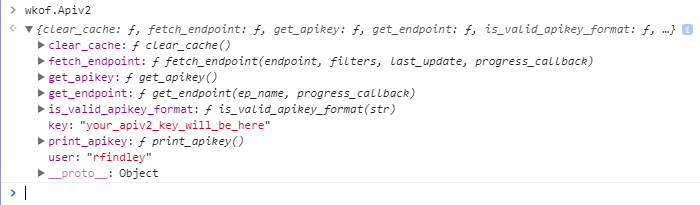
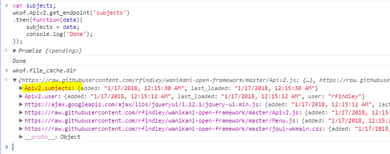

# Apiv2 module



```javascript
fetch_endpoint()   // Fetch an API endpoint from the WK server.  Supports filters,
                   // and automatically fetches all pages of the returned result.
get_endpoint()     // Fetches endpoint data from cache first, then retrieves only
                   // updates from the WK server.
get_apikey()       // For internal use only.  Will probably be removed.
                   // Use wkof.Apiv2.key instead.
is_valid_apikey_format()  // Makes sure a string fits the APIv2 format.
print_apikey()     // Remnant of early development.  Will probably be removed.

key (string)       // Contains the apiv2 key that the framework is currently using.
user (string)      // Contains the username that the framework is currently using.
```
The cached endpoint data is stored in `wkof.file_cache`.  After fetching an endpoint, you will see the cached data appear in the cache (note that it takes about 15 seconds to fetch `/subjects` the first time):



If you want to use a different API key for testing:
```javascript
localStorage.apiv2_key_override = 'someone_elses_key_here';
```
Then refresh the page.  It will automatically clear cached API data (except `/subjects`, which is not user-specific), so you know you'll only be getting the data you want.


