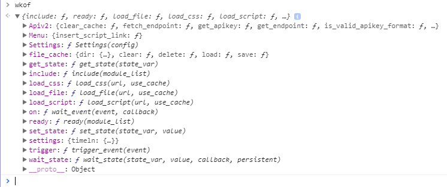

# Getting Started

The main thing to know is that the framework is exposed through `window.wkof`.  From the Javascript console, you can explore what functions and modules are loaded and available:

The modules `Apiv2`, `Menu`, and `Settings` are loaded by the sample_client script.  If no script includes any modules, you'll only see the functions from `Core.js`.
