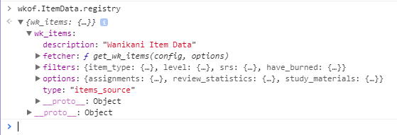

# ItemData module

The ItemData modules provides an interface for fetching data from various registered data sources.  By default, only the Wanikani API is registered.  However, an interface is provided to allow registration of 3rd-party data.

Below is a mini-tutorial for using the ItemData module.

### Using ItemData
First, create a configuration object that specifies what you want to fetch, and what filters you want to apply.

Here's the bare minimum, which will fetch all Wanikani items from the `/subjects` endpoint:
```javascript
wkof.include('ItemData');
wkof.ready('ItemData').then(fetch_items);

function fetch_items() {
	var items_config = {
		wk_items: {}
	};

	wkof.ItemData.get_items(items_config)
	.then(process_items);
}

function process_items(items) {
	// TODO: Do something with your retrieved items.
	console.log('Our data is ready!');
}
```

### Data sources
In the example above, "`wk_items`" is the data source that we are drawing from, and represents all item data from Wanikani, and is built into `ItemData`.  However, `ItemData` is designed to be extended by other scripts, so someone could, for example, write a script that supplies a set of Core10k vocabulary, and registers it with `ItemData`.  That data source could then be found by other scripts (like a quiz script) by looking in `wkof.ItemData.registry`.

Here's a look at the top-level contents `wk_items` in the registry:


The main components to note are:
* **fetcher** -- *a function that fetches the data for this particular registered data source*
* **filters** -- *pre-defined filters for selecting data returned by the fetcher*
* **options** -- *whatever options this data source supports*

#### Options
The `wk_items` data source currently supports the following **options**:
* **assignments** (bool) - *fetch the `/assignments` endpoint and cross-link it with `/subjects`*
* **review_statistics** (bool) - *fetch the `/review_statistics` endpoint and cross-link it with `/subjects`*
* **study_materials** (bool) - *fetch the `/study_materials` endpoint and cross-link it with `/subjects`*

If you explore these **options**, you'll see that they contain meta-data useful for creating a user interface for selecting options, such as data type, label, and default value.

#### Filters
The `wk_items` data source currently supports the following **filters**:
* **level** (string) - *A comma-delimited list of levels and level ranges of items to include in the result.*
* **item_type** (array/multi) - *The item types to include ('rad', 'kan', 'voc').*
* **srs** (array/multi) - *The SRS levels to include ('appr1','appr2',...,'burn').*
* **has_burned** (bool) - *Items that have been burned (including resurrected ones).*

I plan to add more filters as needed, so feel free to make requests.  Keep in mind, though, that your own scripts can also add their own filters directly into the registry if you want them to be available to users and other scripts... like maybe a Leech filter.  Or, if your filter doesn't need to be public, simply use `Array.filter()` on the returned items.

Like the **options**, the **filters** also have meta-data that is helpful for creating a user interface for interactively configuring your data selection.

### Using options and filters
Let's look at an example that makes use of the options and filters:

```javascript
	var items_config = {
		wk_items: {
			options: {
				assignments: true, // API endpoint needed for filtering by SRS level
			},
			filters: {
				item_type: {value:['voc']}, // Include only vocabulary
				level: {value:'1 - -1'}, // Include items from levels 1 to [current level - 1]
				srs: {value: ['appr1','appr2','appr3','appr4']} // Include only Apprentice items
			}
		}
	};
```

You can also invert the result of any filter:

```javascript
	srs: {value: ['enli','burn'], invert: true} // Include all except burned and enlightened
```

### Structure of returned item data
The returned data is an array of items identical to the structure returned by `data` field of the `/subjects` endpoint:
```javascript
[{item1}, {item2}, {item3}, ...]
```
Where each `{item}` is:
```javascript
{
	"id": 1,
	"object": "radical",
	"url": "https://www.wanikani.com/api/v2/subjects/1",
	"data_updated_at": "2017-06-12T23:21:17.248393Z",
	"data": {
		"level": 1,
		"created_at": "2012-02-27T18:08:16.000000Z",
		"slug": "ground",
		"document_url": "https://www.wanikani.com/radicals/ground",
		"character": "一",
		"character_images": [],
		"meanings": [{
			"meaning": "Ground",
			"primary": true
		}]
	}
}
```

Suppose the above radical was `{item2}` in our array of items:
```javascript
item[1].data.meanings[0].meaning
// --> 'Ground'
```

#### Other endpoints
In the **options** field, you can include the following endpoints in your fetch:
* `/assignments`
* `/review_statistics`
* `/study_materials`

These endpoints contain user-specific supplemental data for each item found in the `/subjects` endpoint.
When you include them via the **options** field of the `items_config`, they will be automatically cross-linked to the returned data.  For example:

```javascript
{
	"id": 1,
	"object": "radical",
	"url": "https://www.wanikani.com/api/v2/subjects/1",
	"data_updated_at": "2017-06-12T23:21:17.248393Z",
	"data": { ... },  // <-- Data from the /subjects endpoint
	"assignments": { ... },  // <-- Data from the "/assignments" endpoint
	"review_statistics": { ... },  // <-- Data from the "/review_statistics" endpoint
	"study_materials": { ... },  // <-- Data from the "/study_materials" endpoint
}
```
The format of each sub-object is identical to the `data` sub-object of the corresponding endpoint.
So, for example, if you want to access your `meaning_notes` for the above radical:
```javascript
item[1].study_materials.meaning_synonyms
// --> ["One"]
```